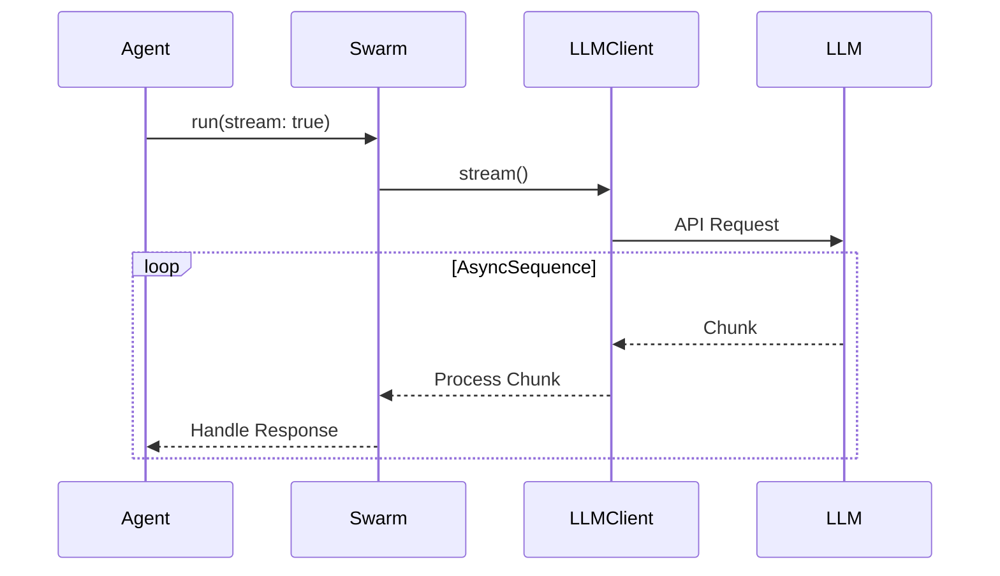

# Swarm Swift Implementation Design Document

## Core Components

1. **Agent System**
   - Core protocol: `Agent`
   - Key responsibilities:
     - Execute requests with context
     - Provide system prompt
     - Define tool choice mode
     - Implement functions with property wrappers

2. **Dynamic Function System**
   - Uses Objective-C runtime for dynamic method dispatch:
   ```swift
   class Agent: NSObject {
       var name: String
       var model: String
       var instructions: String?
       var functions: JSON?
       
       @objc func myCustomFunction(_ args: [String: Any]) -> Data {
           // Function implementation
           let swarmResult = SwarmResult(messages: [...])
           return try! JSONEncoder().encode(swarmResult)
       }
   }
   ```
   
   - Dynamic function calling mechanism:
   ```swift
   func callFunction(agent: Agent, functionName: String, arguments: String) throws -> Any {
       // 1. Validate function exists in agent's function list
       guard let functions = agent.functions,
             let tool = functions.arrayValue.first(where: { $0["function"]["name"].stringValue == functionName }) else {
           throw FunctionCallError.functionNotFound(functionName)
       }
       
       // 2. Generate Objective-C selector
       let selector = NSSelectorFromString("\(functionName):")
       
       // 3. Verify method exists
       guard agent.responds(to: selector) else {
           throw FunctionCallError.functionNotFound(functionName)
       }
       
       // 4. Call method dynamically
       guard let result = agent.perform(selector, with: JSON(arguments).dictionaryObject)?.takeUnretainedValue() else {
           throw FunctionCallError.functionCallFailed(functionName)
       }
       
       // 5. Process result
       if let jsonData = result as? Data {
           return try JSONDecoder().decode(SwarmResult.self, from: jsonData)
       }
       throw FunctionCallError.unexpectedReturnType(functionName, String(describing: type(of: result)))
   }
   ```

   - Runtime method inspection capabilities:
   ```swift
   let methods = class_copyMethodList(type(of: agent), UnsafeMutablePointer<UInt32>.allocate(capacity: 1))
   while let method = methodPtr?.pointee {
       let selector = method_getName(method)
       let methodName = NSStringFromSelector(selector)
       print("- \(methodName)")
       methodPtr = methodPtr?.successor()
   }
   ```

3. **Function Implementation Requirements**
   - Agent class must inherit from `NSObject`
   - Functions must be marked with `@objc`
   - Functions must accept `[String: Any]` arguments
   - Functions must return `Data` containing encoded `SwarmResult`
   - Function names must match the LLM tool names

4. **Example Implementation**
   ```swift
   class WeatherAgent: Agent {
       @objc func get_weather(_ args: [String: Any]) -> Data {
           // 1. Parse arguments
           guard let location = args["location"] as? String else {
               let error = SwarmResult(messages: [Message().withContent("Missing location parameter")])
               return try! JSONEncoder().encode(error)
           }
           
           // 2. Perform weather lookup
           let weather = // ... weather lookup logic
           
           // 3. Create and return result
           let result = SwarmResult(
               messages: [Message().withContent("Weather for \(location): \(weather)")]
           )
           return try! JSONEncoder().encode(result)
       }
       
       override init() {
           super.init()
           
           // Define function for LLM
           self.functions = JSON([
               [
                   "type": "function",
                   "function": [
                       "name": "get_weather",
                       "description": "Get weather for location",
                       "parameters": [
                           "type": "object",
                           "properties": [
                               "location": [
                                   "type": "string",
                                   "description": "City and state"
                               ]
                           ],
                           "required": ["location"]
                       ]
                   ]
               ]
           ])
       }
   }
   ```

3. **Dynamic Function Execution**
   ```swift
   extension Agent {
       func executeFunction(name: String, arguments: [String: Any]) async throws -> Any {
           guard let function = Self.functionRegistry[name] else {
               throw SwarmError.functionNotFound(name)
           }
           
           return try await function.execute(self, arguments)
       }
   }
   ```

4. **Example Usage**
   ```swift
   class WeatherAgent: Agent {
       static var functionRegistry: [String: FunctionMetadata] = [:]
       
       @objc func get_weather(_ args: [String: Any]) -> Data {
           // Function implementation
           let swarmResult = SwarmResult(messages: [...])
           return try! JSONEncoder().encode(swarmResult)
       }
       
       // Called at app startup
       static func initialize() {
           Self.registerFunctions()
       }
   }
   ```

3. **Result System**
   - Core struct: `Result<T>`
   - Encapsulates function return values:
     - value: The actual return value (generic type T)
     - contextUpdates: Updates to context variables
   - Supports:
     - Simple string returns
     - Complex object returns (Codable)
     - Context variable updates

4. **LLM Client System**
   - Base protocol: `LLMClient`
   - Implementations:
     - OpenAIClient
     - AzureOpenAIClient
     - ChatGLMClient
     - OllamaClient
   - Configuration:
     - API keys
     - Base URLs
     - Model selection
     - Provider-specific settings

5. **Context Management**
   - Thread-safe context management using actors
   - Maintains shared context between turns
   - Supports variable persistence
   - Async/await based operations

## Core Workflows

1. **Main Loop Flow**
```swift
Initialize
    - Create active agent
    - Initialize context variables
    - Create message history
    ↓
Start Turn Loop (while history.count - initLen < maxTurns)
    ↓
Get LLM Response
    - Build request with agent, history, context
    - Get completion from LLM (async stream or single response)
    - Check for response errors
    ↓
Process Response
    - If streaming:
        - Accumulate content chunks using AsyncSequence
        - Track tool call messages
        - Create final combined message
    - Add response to history
    ↓
Handle Tool Calls (if present)
    - Extract function name and arguments
    - Validate function exists
    - Parse and convert arguments
    - Execute function with context
    - Add tool call result to history
    - Update active agent if result is Agent
    ↓
Update Context
    - Process context updates
    - Validate updates
    - Apply actor-safe updates
    ↓
Continue or Complete
    - If no tool calls: task complete
    - If max turns reached: complete
    - Otherwise: continue loop
```

2. **Function Discovery Flow**
```swift
Scan Agent Type
    ↓
Find @objc Methods
    ↓
For Each Method:
    - Get function name & description
    - Get parameter annotations
    - Build parameter schema
    - Create function mapping
    ↓
Build Function Descriptions
```

3. **Function Execution Flow**
```swift
Receive Tool Call
    ↓
Find Annotated Method
    ↓
Convert Parameters
    - JSON to Swift types (Codable)
    - Validate required params
    - Apply type conversion
    ↓
Invoke Method
    ↓
Process Result
    - Convert to JSON
    - Update context
```

4. **Result Processing Flow**
```swift
Function Execution
    ↓
Create Result
    - Wrap return value
    - Add context updates
    ↓
Process Result
    - Update context
    - Format for LLM
    - Handle special cases
    ↓
Return to Agent
```

## Example Implementation

1. **Weather Agent Example**
```swift
class WeatherAgent: Agent {
    @objc func get_weather(_ args: [String: Any]) -> Data {
        // Function implementation
        let swarmResult = SwarmResult(messages: [...])
        return try! JSONEncoder().encode(swarmResult)
    }
}
```

2. **Result Struct Example**
```swift
struct Result<T: Codable> {
    let value: T
    private(set) var contextUpdates: [String: Any]
    
    init(_ value: T) {
        self.value = value
        self.contextUpdates = [:]
    }
    
    func withContextUpdate<V>(_ key: String, _ value: V) -> Self {
        var copy = self
        copy.contextUpdates[key] = value
        return copy
    }
}
```

## Key Features

1. **Objective-C Runtime Based Dynamic Function Calling**
   - No manual function registration
   - Automatic schema generation
   - Type-safe parameter handling
   - Swift native type system integration

2. **Flexible LLM Support**
   - Multiple provider support
   - Environment-based configuration
   - Model configuration in client
   - Async/await based API

3. **Simple Agent Development**
   - Conform to Agent protocol
   - Add function property wrappers
   - Define system prompt
   - Async function support

4. **Error Handling**
   - Swift native error handling
   - LLM API errors
   - Function execution errors
   - Parameter validation errors

## Streaming Support

The framework provides real-time streaming capabilities using Swift's AsyncSequence:



1. **Implementation Details**
   - Uses AsyncSequence for backpressure
   - Supports provider-specific formats:
     - OpenAI: Server-Sent Events
     - ChatGLM: Custom streaming
     - Ollama: Line-delimited JSON

2. **Error Handling**
   - Connection failures
   - Malformed responses
   - Rate limiting
   - Token limits

## Error Handling Strategy

1. **Levels of Error Handling**
   - API-level errors (rate limits, authentication)
   - Parsing errors (malformed JSON)
   - Business logic errors (invalid parameters)
   - Network errors (timeouts, disconnects)

2. **Retry Mechanism**
   ```mermaid
   graph TD
       A[Error Occurs] --> B{Retryable?}
       B -->|Yes| C[Exponential Backoff]
       C --> D[Retry Request]
       D --> E{Success?}
       E -->|No| B
       E -->|Yes| F[Continue]
       B -->|No| G[Throw Error]
   ```

3. **Error Categories**
   - Transient: Network issues, rate limits
   - Permanent: Invalid API keys, unsupported models
   - Business: Invalid input, context limits

## Context Management

1. **Thread Safety**
   - Actor-based context management
   - Async property access
   - Copy-on-write for collections

2. **Context Lifecycle**
   ```mermaid
   stateDiagram-v2
       [*] --> Initialize
       Initialize --> Active
       Active --> Updated: Function Call
       Updated --> Active
       Active --> Saved: Save State
       Saved --> Active: Restore
       Active --> [*]: End
   ```

3. **Context Variables**
   - System variables (read-only)
   - User variables (read-write)
   - Function results (append-only)
   - Temporary state (scoped)

4. **Memory Management**
   - ARC-based memory management
   - Context size limits
   - Cleanup strategies
   - Persistence options

## Configuration System

1. **Environment Variables**
   - Provider selection
   - API keys
   - Base URLs
   - Model selection

2. **Example Environment Setup**
```properties
# LLM Configuration
OPENAI_API_KEY=sk-xxx
OPENAI_MODEL=gpt-4

# Azure Configuration
AZURE_OPENAI_KEY=xxx
AZURE_OPENAI_MODEL=gpt-35-turbo

# Other Providers...
```

## Best Practices

1. **Agent Design**
   - Protocol-oriented programming
   - Clear system prompts
   - Well-documented functions
   - Proper error handling

2. **Function Implementation**
   - Clear parameter descriptions
   - Strong type system usage
   - Input validation
   - Meaningful return values

3. **Error Handling**
   - Use Swift's error system
   - Clear error messages
   - Context preservation
   - Retry strategies

4. **Configuration**
   - Use environment variables
   - Provide clear templates
   - Document requirements
   - Validate settings

## Future Enhancements

1. **Additional Features**
   - AsyncSequence streaming
   - Function result caching
   - Batch processing
   - Rate limiting

2. **Provider Support**
   - Additional LLM providers
   - Provider-specific features
   - Custom implementations

3. **Tool Support**
   - Additional parameter types
   - Complex return types (Codable)
   - Nested objects
   - Arrays and collections

4. **Development Tools**
   - XCTest based testing utilities
   - Schema validators
   - Documentation generators
   - Debug helpers

## Swift-Specific Considerations

1. **Concurrency**
   - Use of async/await
   - Actor-based state management
   - AsyncSequence for streaming
   - Task management

2. **Type System**
   - Protocol-oriented design
   - Generic constraints
   - Property wrappers
   - Result types

3. **Memory Management**
   - ARC considerations
   - Weak references
   - Capture lists
   - Resource cleanup

4. **Platform Integration**
   - SwiftNIO for networking
   - Foundation integration
   - Swift Package Manager
   - XCTest integration
